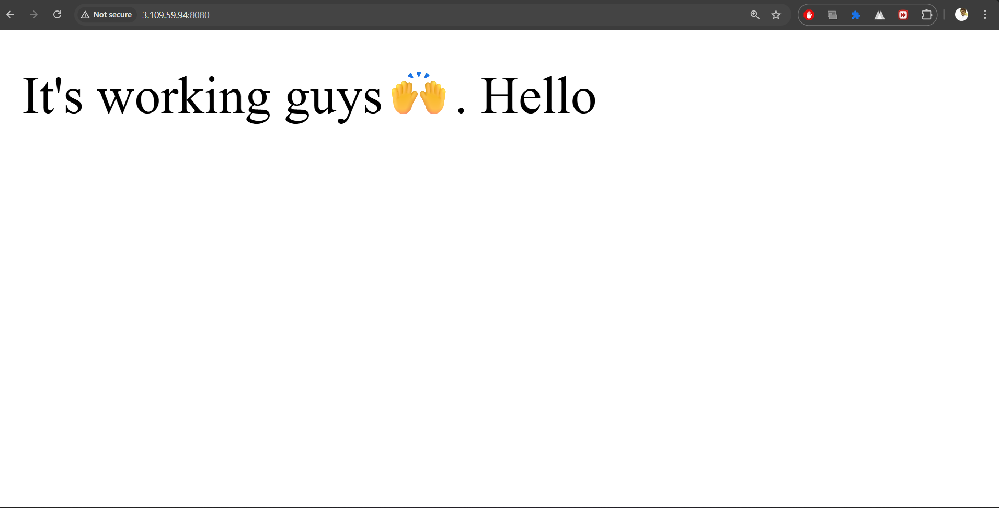

# 🚀 DevOps AWS - Express.js + Docker CI/CD Deployment

A production-ready Express.js TypeScript application with automated CI/CD deployment to AWS EC2 using GitHub Actions and Docker Hub.



## 📋 Table of Contents

- [Overview](#overview)
- [Features](#features)
- [Tech Stack](#tech-stack)
- [Project Structure](#project-structure)
- [Prerequisites](#prerequisites)
- [Quick Start](#quick-start)
- [CI/CD Pipeline](#cicd-pipeline)
- [Deployment Process](#deployment-process)
- [Environment Variables](#environment-variables)
- [API Endpoints](#api-endpoints)
- [Manual Deployment](#manual-deployment)
- [Monitoring & Maintenance](#monitoring--maintenance)
- [Troubleshooting](#troubleshooting)

## 🎯 Overview

This project demonstrates a complete DevOps workflow for deploying a Node.js/Express.js application to AWS EC2. It includes:
- Automated Docker image building and pushing to Docker Hub
- GitHub Actions CI/CD pipeline
- Zero-downtime deployments with health checks
- Nginx reverse proxy configuration
- Production-ready Docker setup

## ✨ Features

- **Automated CI/CD**: Push to main branch triggers automatic deployment
- **Docker Containerization**: Application runs in isolated Docker containers
- **Zero Downtime**: Health checks ensure smooth deployments
- **Security**: SSH-based deployment with secrets management
- **Monitoring**: Health check endpoint for application status
- **Scalability**: Easy to scale with Docker Compose

## 🛠️ Tech Stack

- **Runtime**: Node.js 20 (LTS)
- **Framework**: Express.js 5
- **Language**: TypeScript
- **Containerization**: Docker & Docker Compose
- **CI/CD**: GitHub Actions
- **Cloud**: AWS EC2
- **Web Server**: Nginx (Reverse Proxy)
- **Container Registry**: Docker Hub

## 📁 Project Structure

```
devops-aws/
├── .github/
│   └── workflows/
│       └── deploy-to-ec2.yml    # GitHub Actions CI/CD workflow
├── scripts/
│   ├── build-and-push.sh        # Build & push Docker images
│   └── deploy.sh                # Deploy script for EC2
├── server/
│   ├── src/
│   │   └── index.ts             # Express application entry point
│   ├── Dockerfile               # Multi-stage Docker build
│   ├── docker-compose.yml       # Container orchestration
│   ├── ecosystem.config.cjs     # PM2 configuration (optional)
│   ├── package.json             # Node.js dependencies
│   └── tsconfig.json            # TypeScript configuration
├── deploy.md                    # Detailed deployment guide
├── deployed-pic.png             # Deployment screenshot
└── README.md                    # This file
```

## 📦 Prerequisites

### Local Development
- Node.js 20 or higher
- npm or yarn
- Docker and Docker Compose
- Git

### AWS EC2 Instance
- Ubuntu 20.04/22.04 LTS
- Minimum t2.micro instance
- Security Group with ports 80, 8080, 22 open
- Elastic IP (recommended)

### GitHub Repository
- GitHub account
- Repository with Actions enabled
- Docker Hub account

## 🚀 Quick Start

### 1. Clone the Repository

```bash
git clone <your-repo-url>
cd devops-aws
```

### 2. Install Dependencies

```bash
cd server
npm install
```

### 3. Run Locally

```bash
# Development mode
npm run dev

# Production build
npm run build
npm start
```

### 4. Run with Docker

```bash
cd server
docker-compose up -d
```

Access the application at `http://localhost:8080`

## 🔄 CI/CD Pipeline

The GitHub Actions workflow automatically:

1. **Build Stage**:
   - Checks out the repository
   - Generates image tag from Git SHA
   - Builds Docker image
   - Pushes to Docker Hub

2. **Deploy Stage**:
   - Copies necessary files to EC2
   - Pulls the latest Docker image
   - Performs zero-downtime deployment
   - Validates health checks

### Workflow Triggers

The pipeline runs automatically on:
- Push to `main` branch

## 🎯 Deployment Process

### Initial EC2 Setup

#### 1. Update System Packages

```bash
sudo apt update && sudo apt upgrade -y
```

#### 2. Install Node.js

```bash
sudo apt-get install npm -y
sudo npm i -g n
sudo n lts
```

#### 3. Install Docker

```bash
# Install Docker
curl -fsSL https://get.docker.com -o get-docker.sh
sudo sh get-docker.sh

# Add user to docker group
sudo usermod -aG docker $USER

# Install Docker Compose
sudo apt-get install docker-compose-plugin -y
```

#### 4. Install & Configure Nginx

```bash
# Install Nginx
sudo apt install nginx -y

# Start and enable
sudo systemctl start nginx
sudo systemctl enable nginx
```

#### 5. Configure Nginx Reverse Proxy

Create configuration file:

```bash
sudo nano /etc/nginx/sites-available/express-app
```

Add the following configuration:

```nginx
server {
    listen 80;
    server_name YOUR_EC2_PUBLIC_IP;

    location / {
        proxy_pass http://localhost:8080;
        proxy_http_version 1.1;
        proxy_set_header Upgrade $http_upgrade;
        proxy_set_header Connection 'upgrade';
        proxy_set_header Host $host;
        proxy_set_header X-Real-IP $remote_addr;
        proxy_set_header X-Forwarded-For $proxy_add_x_forwarded_for;
        proxy_set_header X-Forwarded-Proto $scheme;
        proxy_cache_bypass $http_upgrade;
    }
}
```

Enable the configuration:

```bash
sudo ln -s /etc/nginx/sites-available/express-app /etc/nginx/sites-enabled/
sudo rm /etc/nginx/sites-enabled/default
sudo nginx -t
sudo systemctl restart nginx
```

#### 6. Create Application Directory

```bash
sudo mkdir -p /home/$USER/server
cd /home/$USER/server
```

### GitHub Secrets Configuration

Add these secrets to your GitHub repository (Settings → Secrets and variables → Actions):

| Secret Name | Description | Example |
|-------------|-------------|---------|
| `DOCKERHUB_USERNAME` | Docker Hub username | `your-username` |
| `DOCKERHUB_TOKEN` | Docker Hub access token | `dckr_pat_xxx...` |
| `EC2_HOST` | EC2 public IP address | `3.109.59.94` |
| `EC2_USER` | SSH username | `ubuntu` |
| `EC2_SSH_KEY` | Private SSH key | Contents of `.pem` file |
| `EC2_SSH_PORT` | SSH port (optional) | `22` |

## 🔐 Environment Variables

### Application Environment Variables

Create a `.env` file in the `server` directory:

```env
PORT=8000
NODE_ENV=production
```

### GitHub Actions Environment Variables

Set in workflow file or repository variables:

```yaml
env:
  DOCKERHUB_REPO: your-username/your-repo-name
```

## 🌐 API Endpoints

### Health Check
```http
GET /health
```

**Response:**
```json
{
  "status": "ok",
  "timestamp": "2025-12-13T10:30:00.000Z"
}
```

### Root Endpoint
```http
GET /
```

**Response:**
```
It's working guys🙌. Hello
```

## 🔧 Manual Deployment

If you need to deploy manually:

### 1. Build and Push Docker Image

```bash
export DOCKERHUB_REPO=your-username/your-repo
export DOCKERHUB_USERNAME=your-username
export DOCKERHUB_TOKEN=your-token

./scripts/build-and-push.sh
```

### 2. Deploy to EC2

```bash
ssh -i your-key.pem ubuntu@your-ec2-ip

# Run deployment script
./scripts/deploy.sh your-username/your-repo:tag
```

## 📊 Monitoring & Maintenance

### Check Application Status

```bash
# Check Docker containers
docker ps

# View logs
docker logs express-app

# Check Nginx status
sudo systemctl status nginx
```

### Verify Deployment

```bash
# Check health endpoint
curl http://your-ec2-ip/health

# Or visit in browser
http://your-ec2-ip/
```

### View Application Logs

```bash
# Real-time logs
docker logs -f express-app

# Last 100 lines
docker logs --tail 100 express-app
```

## 🐛 Troubleshooting

### Application Not Accessible

1. **Check Security Group**: Ensure ports 80, 8080, and 22 are open
2. **Verify Nginx**: `sudo systemctl status nginx`
3. **Check Docker**: `docker ps` - container should be running
4. **View Logs**: `docker logs express-app`

### Deployment Fails

1. **Verify GitHub Secrets**: All required secrets are set
2. **Check SSH Key**: Ensure private key format is correct
3. **EC2 Permissions**: User has docker group permissions
4. **Disk Space**: `df -h` - ensure sufficient space

### Docker Issues

```bash
# Restart Docker daemon
sudo systemctl restart docker

# Clean up unused containers/images
docker system prune -a

# Rebuild and restart
cd ~/server
docker-compose down
docker-compose up -d --build
```

### Nginx Issues

```bash
# Test configuration
sudo nginx -t

# Restart Nginx
sudo systemctl restart nginx

# Check error logs
sudo tail -f /var/log/nginx/error.log
```

## 📝 Additional Notes

- **Zero Downtime**: The deployment script performs health checks before marking deployment as successful
- **Image Tagging**: Images are tagged with Git SHA (first 7 characters)
- **Rollback**: Previous images are retained in Docker Hub for easy rollback
- **Security**: Never commit secrets or private keys to the repository

## 🤝 Contributing

1. Fork the repository
2. Create a feature branch
3. Commit your changes
4. Push to the branch
5. Open a Pull Request

## 📄 License

This project is open source and available under the MIT License.

## 👤 Author

Created with ❤️ for learning DevOps practices

---

**Need Help?** Check [deploy.md](deploy.md) for detailed deployment instructions.
